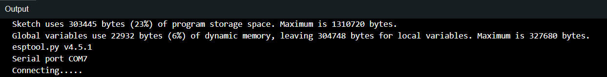

# ESP32 Snake Game - Repositorio GitHub
Este repositorio incluye todos los componentes necesarios para comprender y replicar el juego Snake desarrollado para el microcontrolador ESP32 y su adaptación para PC.

Contenido
- Thesis-Report: Archivos LaTeX del informe de la tesis.
- Images: Imágenes usadas en el README.md
- Snake_minigame_esp32: Código fuente del juego Snake para ESP32.
- Snake_minigame_pc: Versión del juego Snake para PC.

# Uso
Snake minigame esp32 se ha programado en Arduino IDE y la version de PC con C++. En un futuro se plantea añadir un makefile para esta parte y facilitar la compilación.

# Explicación

En principio en este repositorio se busca probar cuánto de flexible es la ESP32 para realizar códigos modulares y escalables. Para ello se ha desarrollado un juego simple como es el snake, sin tener en cuenta la memoria que ocupa el código, sino la facilidad de lectura y modificación del mismo. 

La primera versión del juego ha sido utilizando la librería estandar de C++, la cual no es muy eficiente en cuanto a memoria, pero si en cuanto a facilidad de lectura y modificación. Con vectores de la std, los cuales facilitan la gestión de la memoria, se ha conseguido un código muy legible y fácil de modificar. Además se implementó una clase ScreenManager, la cual se encarga de gestionar la pantalla, y de esta forma se puede cambiar de pantalla fácilmente, de la misma manera de la que se hacía con la ostream en C++.

Al probar esta primera versión en la ESP32, no se ha ocupado tanta memoria cómo se esperada, de hecho solo llegando al 40% de la memoria para guardar el código y un 9% de la memoria dinámica. Pero cuando se ejecuta el código, el ESP32 no para de reiniciarse cuando empieza a acceder a los objetos puntero se reiniciaba el ESP32. Se sospecha que es porque se ha llenado el heap de la memoria dinámica, pero por falta de tiempo no se ha podido comprobar.

Por ello se ha desarrollado una segunda versión del juego, mucho más eficiente en cuanto a memoria, intentando mantener esa legibilidad y facilidad de modificación pero sin implementación de clases. En esta segunda versión se ha conseguido que el juego funcione correctamente en la ESP32, ocupando un 23% de la memoria para guardar el código y un 6% de la memoria dinámica.

Ahora, gracias a la utilización de herramientas para comprobar la cantidad de memoria en ejecución que ocupa el código, se pueden comparar las dos versiones del juego.

